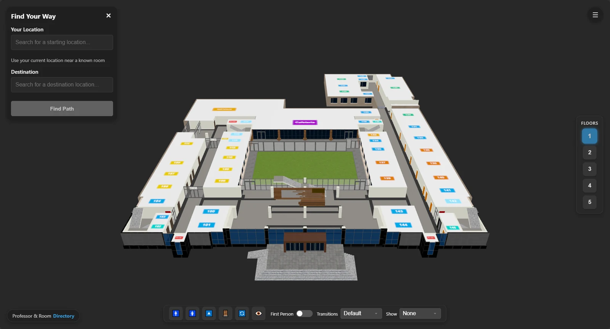
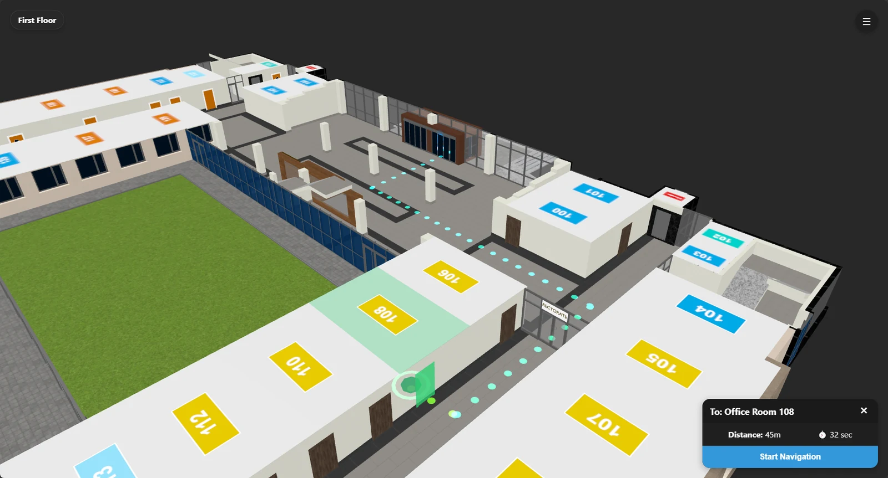
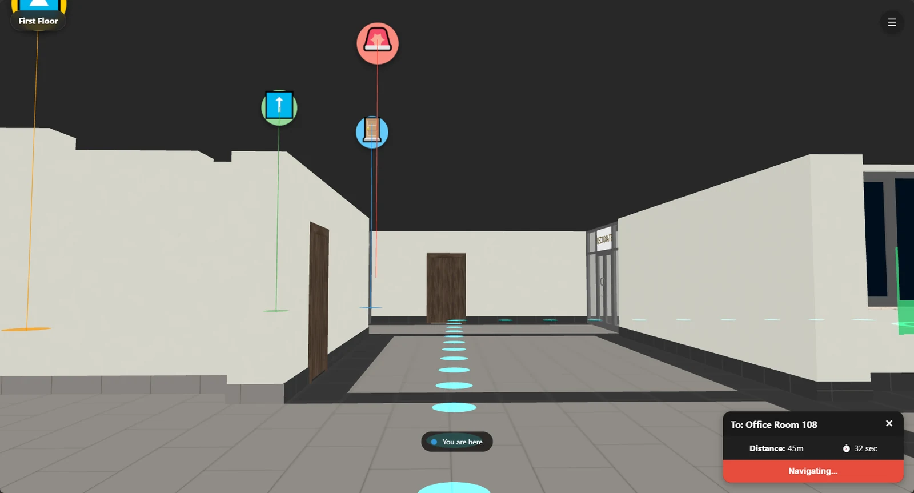
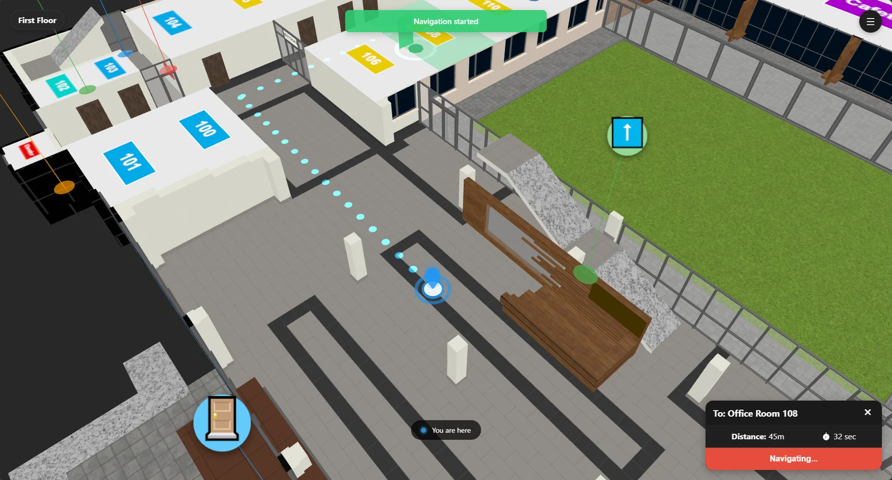
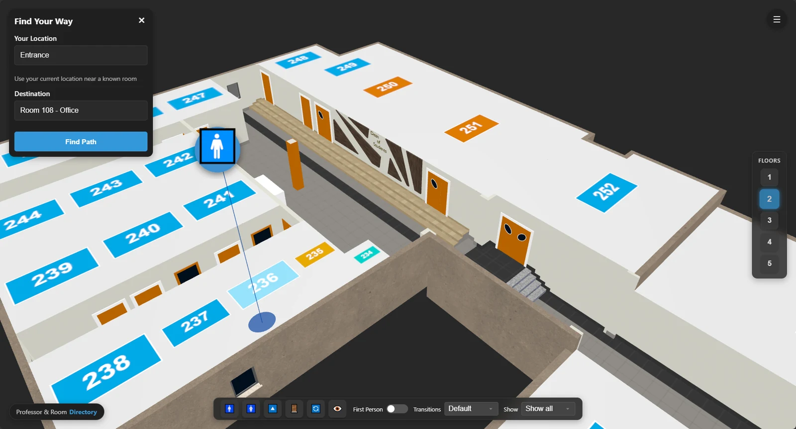
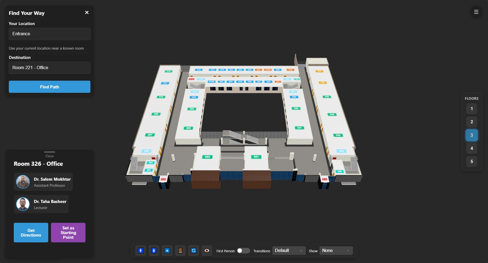
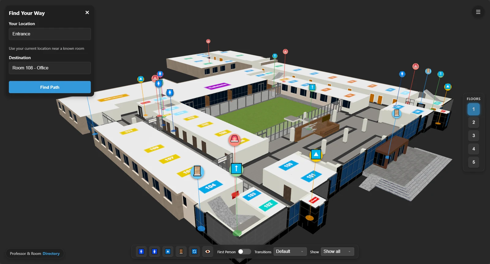
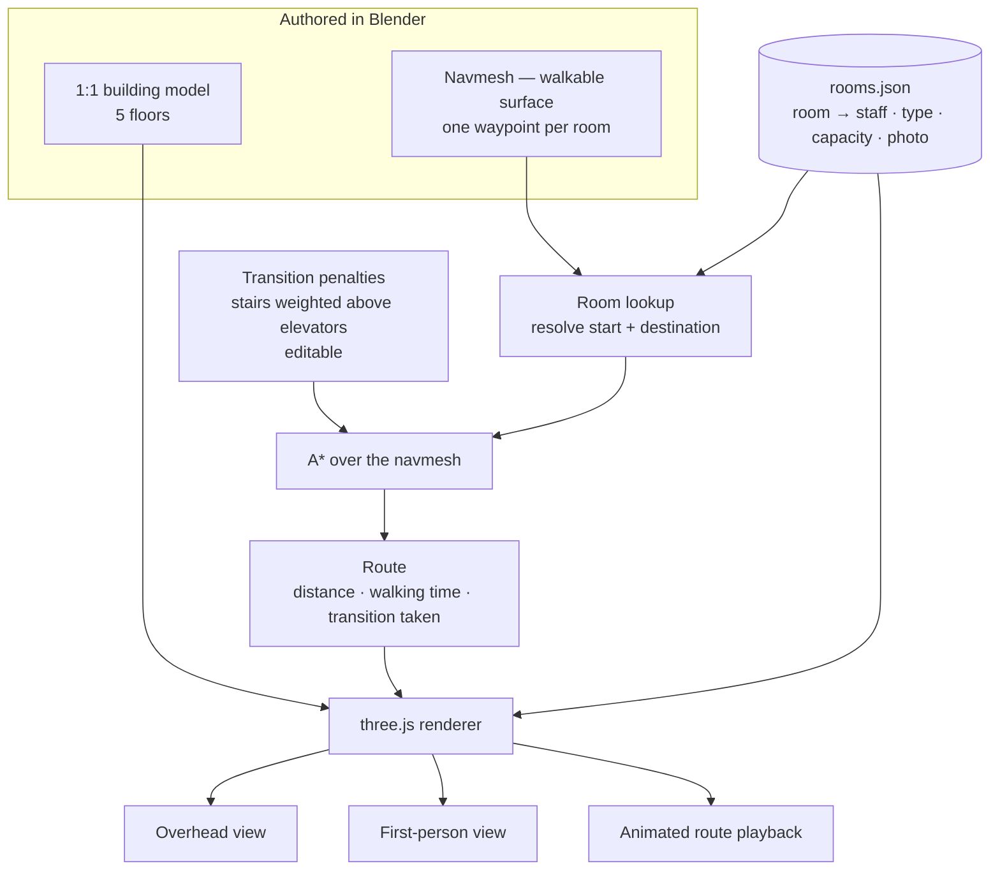

# TIU Campus Navigation

**Indoor pathfinding across a 1:1 scale 3D model of a university building.**

Pick a start and a destination. Get the route, the distance and the walking time —
then follow it from above or from your own eye level.

[**Try it live →**](https://veyoe.com/tiu) · [TIU Assistant](https://veyoe.com/tiuhelp) · [Veyoe](https://veyoe.com)

---

## Find a way

Enter where you are and where you're going. The router returns a path, the distance in metres, and how long it will take to walk.

<table>
<tr>
<td width="50%"></td>
<td width="50%"></td>
</tr>
<tr>
<td><b>Overhead</b> — the path drawn through the building. <b>45 m, 32 seconds</b> to Office Room 108.</td>
<td><b>First person</b> — the same route at eye level, with the path laid out on the floor ahead of you and a <b>You are here</b> marker.</td>
</tr>
</table>

The first-person mode is the point. An overhead map tells you where a room *is*; walking the corridor with the path on the floor in front of you tells you how to *get there*. Most indoor wayfinding tools stop at the first one.

### Walk it before you walk it

Starting navigation animates a marker along the full route, so you can watch the way through before you set off.

This is a **route animation, not live position tracking** — and that's deliberate. GPS doesn't work indoors, and the alternatives (Wi-Fi trilateration, BLE beacons) mean hardware in every corridor and accuracy that still drops you in the wrong room. Rather than ship unreliable positioning, the route plays itself: you see the whole path, the turns and the floor changes before you start walking, which is what you actually need from a building you don't know.

---

## The building knows what's in it

Rooms aren't just labelled boxes. Each one carries its own record — what it is, who's in it, and what it holds.

<table>
<tr>
<td width="50%"></td>
<td width="50%"></td>
</tr>
<tr>
<td><b>Offices</b> — Room 326 lists both occupants with their titles, each with <b>Get Directions</b> and <b>Set as Starting Point</b>.</td>
<td><b>Classrooms</b> — Room 202 carries a photo of the actual room and its capacity (88 students), alongside the options panel.</td>
</tr>
</table>

Selecting any room gives you two actions — route *to* it, or route *from* it — so the same tap works whether you're looking for a place or standing in one.

---

## Wayfinding, not just addressing

Most of the time people don't know the room number of what they need — they need *the nearest one*. Every feature in the building is pinned and searchable: restrooms (male and female), elevators, stairs, doors and emergency equipment. **Quick Access** puts the nearest male restroom, female restroom and elevator one tap away.

Pins can be shown all at once, filtered to one type, or hidden entirely.

---

## Routing that accounts for how people move

The interesting problem in indoor navigation isn't finding the shortest path. It's that the shortest path is often the wrong one.

Someone with a mobility impairment, someone carrying equipment, and someone in a hurry all want different routes between the same two rooms, and only one of those is the shortest.

### Penalties, not filters

Floor transitions are handled with a **penalty system**. Stairs carry a higher traversal cost than elevators, and the penalties are editable rather than hard-coded into the router.

That choice is the whole design. Filtering stairs out of the graph would give you a router that simply **fails** — no path at all — the moment a lift is out of service or a floor has no elevator access. Weighting them instead means the router always finds a way; it just prefers not to use one. And when the step-free route is twice as long, it will take the stairs anyway and tell you that's what it did.

Tuning the numbers changes the routing behaviour without touching the pathfinder.

The route readout names the transition it chose: *"139 m via front left elevator"* is a different answer from *"110 m via the north stairs"*, and the difference matters to the person walking it.

---

## Accessibility and performance

| Setting | Why it's there |
|---|---|
| **High Contrast Mode** | Room labels and paths readable for low-vision users |
| **Model Quality** | Drops geometry detail so the 3D model runs on low-end phones |
| **Theme** | Light and dark |
| **Show Room Labels** | Declutter the view when you only want the path |
| **Show Professor Info** | Overlay occupant names directly on the 3D rooms |
| **First Person Mode** | Switch between overhead and eye level |

Model Quality deserves a mention: a 3D building model is useless to a student on a three-year-old phone if it won't load. Making detail adjustable is the difference between a demo and something people actually use in a corridor.

---

## How it works

### One source of truth

The navmesh is authored in Blender alongside the building itself, with a waypoint dropped in every room — so the geometry and the navigation graph come out of the same file and can't drift apart. Move a wall and the walkable surface moves with it.

Room records live in a **JSON data file** that maps every room to its occupants, type, capacity and photo. That's separate from the MySQL database behind [TIU Assistant](https://veyoe.com/tiuhelp): the two systems agree on room identifiers, not on storage, so either can be updated without breaking the other.

---

## Used in production

This engine is the navigation layer behind **[TIU Assistant](https://veyoe.com/tiuhelp)**. When the assistant answers *"where is Dr. X's office?"*, its **View on 3D Map** action opens this system and routes the user to that room — so a natural-language question ends with a path on the floor in front of them.

---

## Stack

`JavaScript` · `three.js` · `Blender` · `A* pathfinding` · `Navmesh` · `JSON`

---

## Repository status

This is a **showcase repository** — the production source is private. This page documents the design and behaviour of the system.

Try it live at **[veyoe.com/tiu](https://veyoe.com/tiu)**.

---

**Built by [Zanyar Abdulbast](https://github.com/zanyarrrrrr)**
Originally developed during an internship at Tishk International University, now maintained at [Veyoe](https://veyoe.com)
Erbil, Kurdistan Region of Iraq

